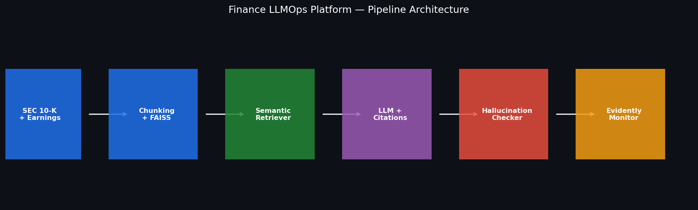
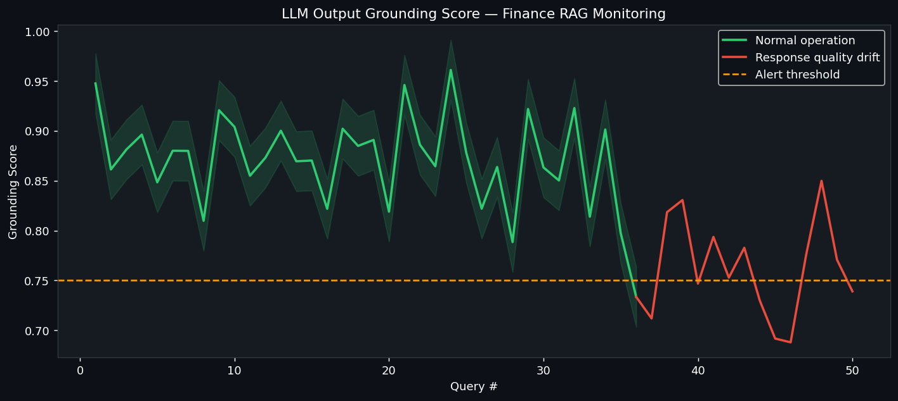
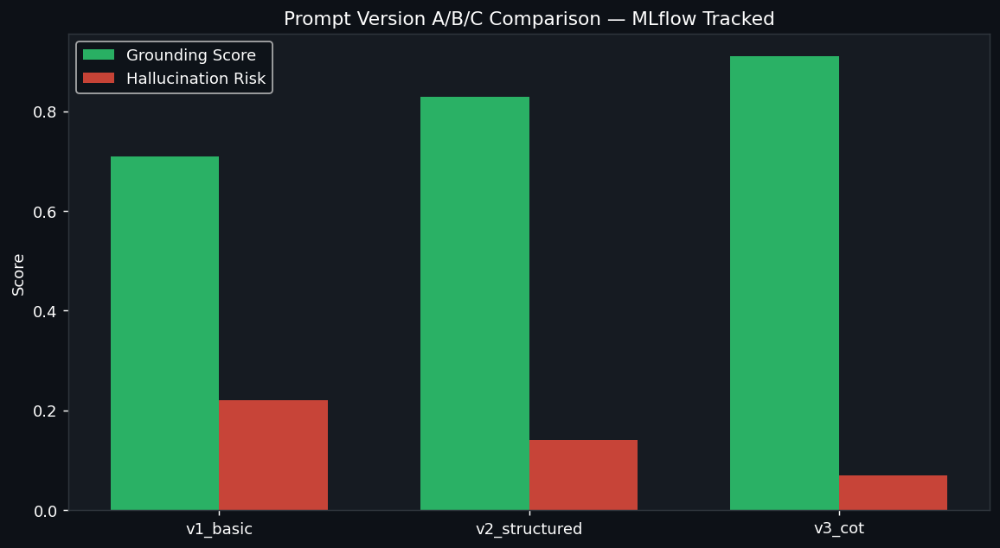

---

# Finance LLMOps Platform

[](https://github.com/shaikn6/finance-llmops-platform/actions/workflows/ci.yml)
[](https://www.python.org/downloads/release/python-3110/)
[](https://streamlit.io)
[](https://mlflow.org)
[](https://opensource.org/licenses/MIT)

> Production-grade RAG pipeline for financial document intelligence: SEC 10-K filings + earnings call transcripts with citation-grounded answers, hallucination detection, Evidently AI monitoring, and MLflow prompt versioning.

---


## Screenshots






## STAR — Project Background

### Situation

Financial analysts manually extract risk signals from 10-K filings and earnings calls — liquidity ratios, capital adequacy metrics, credit quality indicators, covenant compliance flags. The work is slow, repetitive, and scales poorly with deal volume.

Applying an LLM naively makes it worse: an **unverified, hallucinated number in a credit analysis or regulatory report is a compliance liability**, and AI governance is now an explicit supervisory priority for bank examiners. Generic RAG implementations lack the citation tracking and output monitoring that regulated financial environments require — an off-the-shelf chatbot cannot prove that a stated capital ratio actually came from the filing.

### Task

Build a **production LLMOps pipeline** for financial document intelligence with three non-negotiable requirements:

1. Every factual answer must be traceable to a specific source passage — **mandatory citation tracking**.
2. Every output must be scored for grounding — **hallucination detection at inference time**.
3. Answer quality must be tracked across prompt iterations — **prompt experiment versioning**.

### Action

Built a full LLMOps stack in Python:

- **FAISS vector store** (sentence-transformers `all-MiniLM-L6-v2`, 384-dim, cosine similarity) — no external vector DB dependency
- **Citation-grounded generation** — each answer includes source chunk IDs, doc names, and relevance scores
- **Token-overlap hallucination detection** — extracts factual claims (numbers, percentages, dates, acronyms) and checks each against cited chunks
- **Evidently AI monitoring** — tracks response length, grounding score, hallucination risk, and retrieval quality drift over time
- **MLflow prompt experiment tracking** — version prompt templates (`v1_basic`, `v2_structured`, `v3_cot`), log metrics, and compare runs side-by-side (CSV fallback when MLflow is absent)
- **Optional multi-agent path** — a Researcher → Analyst → FactChecker → Synthesizer state machine over the same retriever and grounding primitives (`agents/multi_agent_rag.py`)
- **5-tab Streamlit dashboard** — chat interface, source evidence explorer, grounding gauge, drift charts, prompt lab

```mermaid
flowchart TD
    Ingest["Ingestion<br/>chunk 500 / overlap 50<br/>MiniLM-384 → FAISS IndexFlatIP<br/>pipeline/ingestion.py"]

    A["User question"] --> B["FinancialRetriever<br/>embed → FAISS top-k (cosine)<br/>pipeline/retriever.py"]
    Ingest -. index.faiss .-> B
    B -->|"RetrievedChunk + score"| D["FinancialAnswerGenerator<br/>versioned prompt · OpenAI gpt-4 / mock<br/>pipeline/generator.py"]
    D -->|"answer + Citations"| F["HallucinationDetector<br/>regex claims → token overlap vs cited chunks<br/>pipeline/hallucination.py"]
    F --> G{"Grounding score<br/>vs threshold 0.70"}
    G -->|"≥ 0.70"| H["Answer released (grounded)"]
    G -->|"< 0.70"| I["Flagged: hallucination risk"]

    D --> J["LLMMonitor<br/>JSONL log → Evidently / PSI drift<br/>pipeline/monitor.py"]
    D --> L["MLflow prompt tracker<br/>v1/v2/v3 · CSV fallback<br/>experiments/prompt_tracker.py"]
    F --> Dash["Streamlit + Plotly dashboard<br/>dashboard/app.py"]
    J --> Dash
    L --> Dash

    B -. alt orchestration .-> MA["Multi-agent RAG<br/>Researcher → Analyst → FactChecker → Synthesizer<br/>agents/multi_agent_rag.py"]
    Eval["Eval harness<br/>RAGAS-style metrics → CSV<br/>evaluation/eval_harness.py"] -.-> B

    style H fill:#064e3b,color:#6ee7b7
    style I fill:#450a0a,color:#fca5a5
    style G fill:#1a2744,color:#93c5fd
```

### Result

This repository is a working LLMOps reference pipeline, not a benchmark of any specific deployment. What it actually delivers:

- **Citation-grounded generation** — every answer carries the source chunk IDs, document names, and cosine relevance scores it was built from (`pipeline/generator.py`).
- **Inference-time grounding gate** — each factual claim (dollar amounts, percentages, basis points, dates, ratio acronyms such as LCR / CET1 / NIM / HQLA) is extracted by regex and checked for token overlap against its cited chunks; answers whose grounding falls below the `GROUNDING_THRESHOLD` (default **0.70**) are flagged as hallucination risk (`pipeline/hallucination.py`).
- **Drift monitoring** — interactions are logged to JSONL and analyzed with Evidently AI, with a manual **PSI (Population Stability Index, >0.2 = drift)** pandas fallback when Evidently is unavailable (`pipeline/monitor.py`).
- **Prompt experiment tracking** — three versioned prompt templates (`v1_basic`, `v2_structured`, `v3_cot`) tracked via MLflow with a CSV fallback (`experiments/prompt_tracker.py`).
- **Runtime-computed evaluation** — a RAGAS-style harness computes faithfulness, relevance, answer-similarity F1, and context precision/recall over a fixed QA set (`evaluation/eval_harness.py`), writing CSV results.
- **No API key required** — the full pipeline runs in `MOCK_MODE` for local development and CI; set `MOCK_MODE=false` to route generation through OpenAI `gpt-4`.

> **On the sample data.** The bundled corpus (`data/sample_10k_excerpts.txt`, `data/sample_earnings_calls.txt`) and the `EdgarSimulator` describe **fictional companies** generated for a key-free demo. The evaluation harness therefore measures the pipeline's self-consistency on synthetic data — it is a methodology demonstration, **not** a measured accuracy figure against real filings. Any "time saved" or accuracy framing in a demo answer is illustrative scenario copy, not a result produced by this repo.

---

## Dashboard — 5 Tabs

### Tab 1: Ask
Chat interface for financial questions. Type a question, get a cited answer with source document badges and a real-time grounding score. Suggested questions included for demo.

### Tab 2: Source Evidence
Semantic search explorer — query the FAISS index directly, see retrieved chunks ranked by cosine similarity with full source text and metadata expanded per result.

### Tab 3: Hallucination Check
Plotly gauge chart showing grounding score 0–100%. Per-claim breakdown table shows which numbers, percentages, and acronyms are grounded vs. uncited. Color-coded green/red claim tags.

### Tab 4: LLM Monitoring
Four Plotly line/bar charts tracking: grounding score over time, hallucination risk trend, response length distribution, and retrieval similarity scores. Evidently AI drift report table shows per-metric drift detection.

### Tab 5: Prompt Lab
MLflow experiment comparison table across the `v1_basic`, `v2_structured`, and `v3_cot` prompt versions. Bar chart comparing avg grounding score per version. Scatter plot: grounding vs. latency quality–speed tradeoff.

---

## Quickstart (No API Key Required)

```bash
# 1. Clone
git clone https://github.com/shaikn6/finance-llmops-platform.git
cd finance-llmops-platform

# 2. Create virtual environment
python -m venv .venv && source .venv/bin/activate  # Windows: .venv\Scripts\activate

# 3. Install dependencies
pip install -r requirements.txt

# 4. Build FAISS index from sample documents (one-time, ~30 seconds)
MOCK_MODE=true python -c "from pipeline.ingestion import build_faiss_index; build_faiss_index(force_rebuild=True)"

# 5. Launch dashboard (mock mode — no OpenAI key needed)
MOCK_MODE=true streamlit run dashboard/app.py
```

Open http://localhost:8501

### With Docker Compose

```bash
docker-compose up --build
```

Dashboard: http://localhost:8501 | MLflow UI: http://localhost:5000

### With OpenAI API Key (Live Mode)

```bash
export OPENAI_API_KEY=sk-...
export MOCK_MODE=false
streamlit run dashboard/app.py
```

---

## Run Tests

```bash
# Build index first (needed for retriever tests)
MOCK_MODE=true python -c "from pipeline.ingestion import build_faiss_index; build_faiss_index()"

# Run full test suite
pytest tests/ -v --cov=pipeline --cov=experiments --cov-report=term-missing
```

---

## Project Structure

```
finance-llmops-platform/
├── README.md
├── docker-compose.yml
├── Dockerfile
├── requirements.txt
├── data/
│   ├── sample_10k_excerpts.txt       # synthetic 10-K excerpts (fictional companies)
│   ├── sample_earnings_calls.txt     # synthetic earnings-call excerpts
│   ├── edgar_simulator.py            # EdgarSimulator — fabricated 10-K sections, no network
│   └── faiss_index/                  # built at runtime (gitignored)
├── pipeline/
│   ├── ingestion.py      # chunk → embed (MiniLM) → FAISS IndexFlatIP
│   ├── retriever.py      # semantic search, top-k with metadata
│   ├── generator.py      # citation-grounded answers, OpenAI gpt-4 / mock
│   ├── hallucination.py  # token-overlap grounding check per factual claim
│   └── monitor.py        # Evidently AI + PSI drift tracking
├── agents/
│   └── multi_agent_rag.py # Researcher → Analyst → FactChecker → Synthesizer
├── evaluation/
│   └── eval_harness.py   # RAGAS-style metrics (faithfulness, precision/recall) → CSV
├── experiments/
│   └── prompt_tracker.py # MLflow prompt version comparison (CSV fallback)
├── streaming/
│   └── stream_handler.py # FastAPI SSE + Streamlit token streaming
├── dashboard/
│   ├── app.py            # 5-tab Streamlit dashboard
│   └── app_v2.py         # V2 dashboard
├── tests/                # 292 test functions across 8 suites
├── .github/workflows/ci.yml
└── docs/architecture.md
```

---

## Tech Stack

Versions reflect `requirements.txt`.

| Component | Library |
|-----------|---------|
| Embeddings | sentence-transformers (`all-MiniLM-L6-v2`, 384-dim) |
| Vector Search | faiss-cpu (`IndexFlatIP`, cosine on normalized vectors) |
| LLM | openai `gpt-4` (optional; mock by default) |
| Orchestration | LangChain (optional), custom multi-agent state machine |
| Monitoring | evidently 0.4.16 + manual PSI fallback |
| Experiment Tracking | mlflow 3.11.1 (CSV fallback) |
| Streaming | FastAPI / uvicorn SSE (optional) |
| Dashboard | streamlit 1.54.0 + plotly |
| Data | pandas / numpy |
| Testing | pytest 9 + pytest-cov (292 tests) |

---

## Configuration

| Environment Variable | Default | Description |
|---------------------|---------|-------------|
| `MOCK_MODE` | `true` | `true` = no OpenAI key needed; `false` = live GPT-4 calls |
| `OPENAI_API_KEY` | (none) | Required only when `MOCK_MODE=false` |
| `MLFLOW_TRACKING_URI` | local SQLite | Set to remote MLflow server URI for team sharing |

---

## License

MIT — see LICENSE for details.

Built as part of a personal financial-AI infrastructure portfolio (2024).
