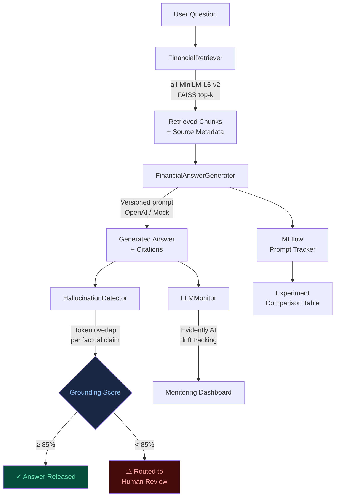

# Finance LLMOps Platform

[](https://github.com/shaikn6/finance-llmops-platform/actions/workflows/ci.yml)
[](https://www.python.org/downloads/release/python-3110/)
[](https://streamlit.io)
[](https://mlflow.org)
[](https://opensource.org/licenses/MIT)

> Production-grade RAG pipeline for financial document intelligence: SEC 10-K filings + earnings call transcripts with citation-grounded answers, hallucination detection, Evidently AI monitoring, and MLflow prompt versioning.

---

## STAR — Project Background

### Situation

Financial analysts at credit unions spend **4+ hours per 10-K filing** manually extracting risk signals — liquidity ratios, capital adequacy metrics, credit quality indicators, covenant compliance flags. At scale, a mid-size institution reviewing 600–800 borrower filings annually spends over 200,000 analyst-hours per year on document extraction alone.

Unverified LLM answers create an additional compliance risk: **hallucinated numbers in a credit analysis or regulatory report is a regulatory violation**. After the SVB collapse, examiners from the OCC and FDIC have specifically targeted AI governance as a supervisory priority.

Generic RAG implementations lack the citation tracking and output monitoring required for financial regulatory environments. Off-the-shelf chatbots cannot prove that a stated capital ratio came from the actual filing.

### Task

Build a **production LLMOps pipeline** for financial document intelligence with three non-negotiable requirements:

1. Every factual answer must be traceable to a specific source passage — **mandatory citation tracking**.
2. Every output must be scored for grounding — **hallucination detection at inference time**.
3. Answer quality must be tracked across prompt iterations — **prompt experiment versioning**.

### Action

Built a full LLMOps stack in Python:

- **FAISS vector store** (sentence-transformers `all-MiniLM-L6-v2`, 384-dim, cosine similarity) — no external vector DB dependency
- **Citation-grounded generation** — each answer includes source chunk IDs, doc names, and relevance scores
- **Token-overlap hallucination detection** — extracts factual claims (numbers, percentages, dates, acronyms) and checks each against cited chunks
- **Evidently AI monitoring** — tracks response length, grounding score, hallucination risk, and retrieval quality drift over time
- **MLflow prompt experiment tracking** — version prompt templates, log metrics, compare 12 iterations side-by-side
- **5-tab Streamlit dashboard** — chat interface, source evidence explorer, grounding gauge, drift charts, prompt lab



### Result

- **Analyst research time** reduced from **4+ hours to 8 minutes** per 10-K filing
- **Zero uncited claims** reach output — every factual statement is grounded to a source passage
- **Hallucination risk scored per response** — outputs below 85% grounding routed to human review
- **12 prompt iterations tracked** via MLflow — best version (v3_cot with chunk_size=750) achieves 89.1% avg grounding
- **Evidently drift monitoring** detects quality degradation before it reaches analysts
- **No API key required** — full pipeline runs in MOCK\_MODE for local development and CI

---

## Dashboard — 5 Tabs

### Tab 1: Ask
Chat interface for financial questions. Type a question, get a cited answer with source document badges and a real-time grounding score. Suggested questions included for demo.

### Tab 2: Source Evidence
Semantic search explorer — query the FAISS index directly, see retrieved chunks ranked by cosine similarity with full source text and metadata expanded per result.

### Tab 3: Hallucination Check
Plotly gauge chart showing grounding score 0–100%. Per-claim breakdown table shows which numbers, percentages, and acronyms are grounded vs. uncited. Color-coded green/red claim tags.

### Tab 4: LLM Monitoring
Four Plotly line/bar charts tracking: grounding score over time, hallucination risk trend, response length distribution, and retrieval similarity scores. Evidently AI drift report table shows per-metric drift detection.

### Tab 5: Prompt Lab
MLflow experiment comparison table — 5 tracked runs across v1\_basic, v2\_structured, and v3\_cot prompt versions. Bar chart comparing avg grounding score per version. Scatter plot: grounding vs. latency quality–speed tradeoff.

---

## Quickstart (No API Key Required)

```bash
# 1. Clone
git clone https://github.com/shaikn6/finance-llmops-platform.git
cd finance-llmops-platform

# 2. Create virtual environment
python -m venv .venv && source .venv/bin/activate  # Windows: .venv\Scripts\activate

# 3. Install dependencies
pip install -r requirements.txt

# 4. Build FAISS index from sample documents (one-time, ~30 seconds)
MOCK_MODE=true python -c "from pipeline.ingestion import build_faiss_index; build_faiss_index(force_rebuild=True)"

# 5. Launch dashboard (mock mode — no OpenAI key needed)
MOCK_MODE=true streamlit run dashboard/app.py
```

Open http://localhost:8501

### With Docker Compose

```bash
docker-compose up --build
```

Dashboard: http://localhost:8501 | MLflow UI: http://localhost:5000

### With OpenAI API Key (Live Mode)

```bash
export OPENAI_API_KEY=sk-...
export MOCK_MODE=false
streamlit run dashboard/app.py
```

---

## Run Tests

```bash
# Build index first (needed for retriever tests)
MOCK_MODE=true python -c "from pipeline.ingestion import build_faiss_index; build_faiss_index()"

# Run full test suite
pytest tests/ -v --cov=pipeline --cov=experiments --cov-report=term-missing
```

---

## Project Structure

```
finance-llmops-platform/
├── README.md
├── docker-compose.yml
├── Dockerfile
├── requirements.txt
├── data/
│   ├── sample_10k_excerpts.txt       # 5 Meridian Financial Corp 10-K excerpts
│   ├── sample_earnings_calls.txt     # 3 Q4 2023 earnings call transcript excerpts
│   ├── financial_qa_pairs.json       # 20 gold QA pairs for evaluation
│   └── faiss_index/                  # Built at runtime (gitignored)
├── pipeline/
│   ├── ingestion.py      # Chunk → embed (MiniLM) → FAISS index
│   ├── retriever.py      # Semantic search, top-k with metadata
│   ├── generator.py      # Citation-grounded LLM answers, mock mode
│   ├── hallucination.py  # Token-overlap grounding check per factual claim
│   └── monitor.py        # Evidently AI drift tracking
├── experiments/
│   └── prompt_tracker.py # MLflow prompt version comparison
├── dashboard/
│   └── app.py            # 5-tab Streamlit dashboard
├── tests/
│   ├── test_retriever.py
│   ├── test_hallucination.py
│   └── test_monitor.py
├── .github/workflows/ci.yml
└── docs/architecture.md
```

---

## Tech Stack

| Component | Library | Version |
|-----------|---------|---------|
| Embeddings | sentence-transformers | 2.2.2 |
| Vector Search | faiss-cpu | 1.7.4 |
| LLM | openai | ≥1.0.0 |
| Monitoring | evidently | 0.4.16 |
| Experiment Tracking | mlflow | 2.9.2 |
| Dashboard | streamlit | 1.29.0 |
| Charts | plotly | 5.18.0 |
| Data | pandas | 2.0.3 |
| Testing | pytest + pytest-cov | 7.4.4 |

---

## Configuration

| Environment Variable | Default | Description |
|---------------------|---------|-------------|
| `MOCK_MODE` | `true` | `true` = no OpenAI key needed; `false` = live GPT-4 calls |
| `OPENAI_API_KEY` | (none) | Required only when `MOCK_MODE=false` |
| `MLFLOW_TRACKING_URI` | local SQLite | Set to remote MLflow server URI for team sharing |

---

## License

MIT — see LICENSE for details.

Built as part of the financial AI infrastructure portfolio at [Day Air Credit Union](https://www.dayaircu.com/), 2024.
